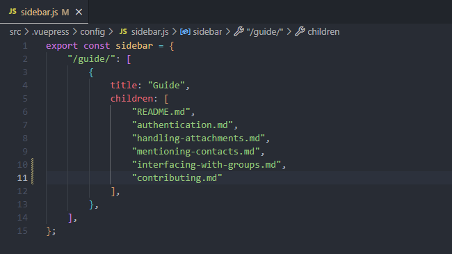

# Contributing

If you are interested in contributing to this project, please read the following guidelines.

## Setup

1. Fork the repository from the **main** branch
2. Run `npm install` to install all dependencies
3. Run `npm run docs:dev` to start the development server
4. Add now your changes and test them locally
5. Commit your changes and push them to your forked repository
6. Create a pull request to the **main** branch of this repository
7. Wait for a maintainer to review your changes


## Adding improvements

You are free in adding improvements to this guide. If you want to add a new page, you can create a new Markdown file in the `docs` folder. If you want to add a new section to an existing page, you can edit the Markdown file of the page. Here is an example of adding a new Markdown file:

1. Create a new Markdown file in the `guide` folder
2. Add the following frontmatter to the top in the file:
```md
---
lang: en-US
title: Contributing
description: How to contribute to this guide.
---
```
3. Add now the new content to the file
4. Add the file to the `guide` section in the `sidebar.js` file in the `.vuepress` folder
    <div>
        <br />
	    
    </div>
   **Note:** The correct name of the file is required with the **.md** extension
5. Visit the page in your browser on `http://localhost:8080/guide/your-file-name.html`

If you want to learn more about adding [Markdown](https://v2.vuepress.vuejs.org/guide/markdown.html) feastues or [Assests](https://v2.vuepress.vuejs.org/guide/assets.html), you can read the VuePress documentation.

### Adding new packages

Please feel welcome to contribute themes, packages, or plugins to the Guide, but ensure that they align with the guide's established style and theme.

## what belongs in this guide and what does not

By adhering to these guidelines, we can collectively maintain the quality and usefulness of this guide for the benefit of our community. If you have any questions or suggestions regarding what should be included or excluded, please feel free to engage in the contribution process or discuss it with fellow contributors. Together, we can make this guide an invaluable resource.

### Inclusions

1. **Relevant Topics:** Include content that directly relates to the subject matter covered by this guide. Information, tips, and best practices that contribute to a better understanding of the topic are highly encouraged.

2. **Correct and Up-to-Date Information:** Include accurate and current information. Regularly review and update the content to reflect any changes or developments in the field.

3. **Quality and Depth:** Aim for high-quality content that provides depth and insight. In-depth explanations, examples, and practical advice are valuable additions.

4. **Contributions from the Community:** Encourage contributions from the community, whether it's through code samples, real-world use cases, or additional insights. Collaboration enhances the guide's value.

### Exclusions

1. **Irrelevant Content:** Exclude information or content that does not pertain to the guide's main subject matter. Keeping the guide focused ensures it remains a useful resource.

2. **Outdated Information:** Avoid including information that is outdated or no longer relevant. Continuously review and remove obsolete content to maintain accuracy.

3. **Plagiarized or Unauthorized Material:** Do not include any content that violates copyright or intellectual property rights unless you have proper authorization or permission.

4. **Personal Opinions or Biases:** Refrain from inserting personal opinions, biases, or subjective information. Stick to objective, factual, and unbiased content.

5. **Unverified Claims:** Avoid making unsubstantiated claims or statements. Ensure that any data or statistics included are properly sourced and verified.
-->