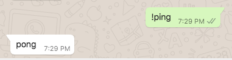

# Getting Started

:::warning
The whatsapp-web.js guide is still a work in progress. To learn about all the features available to you in the library, please check out the [documentation](https://docs.wwebjs.dev/).
:::

## Installation


You can get the module from npm:

```bash
$ npm i whatsapp-web.js
```

:::tip Info
 NodeJS v12 or higher is required
:::

### Installation on no-gui systems

:::warning
If you want to install whatsapp-web.js on a system without GUI (for example `linux server images` that can just be accessed over a shell and dont have something like a desktop) there are a couple of things you need to do so puppeteer can emulate the chromium browser.
:::

For puppeteer to work, you need to install the following dependencies with the `apt-get` command (remember to `apt-get update` before you install)
```bash
$ sudo apt install -y gconf-service libgbm-dev libasound2 libatk1.0-0 libc6 libcairo2 libcups2 libdbus-1-3 libexpat1 libfontconfig1 libgcc1 libgconf-2-4 libgdk-pixbuf2.0-0 libglib2.0-0 libgtk-3-0 libnspr4 libpango-1.0-0 libpangocairo-1.0-0 libstdc++6 libx11-6 libx11-xcb1 libxcb1 libxcomposite1 libxcursor1 libxdamage1 libxext6 libxfixes3 libxi6 libxrandr2 libxrender1 libxss1 libxtst6 ca-certificates fonts-liberation libappindicator1 libnss3 lsb-release xdg-utils wget
```

You will also need to set the `--no-sandbox` flag in the puppeteer launch command
```js
...
new Client({
	...,
	puppeteer: {
		args: ['--no-sandbox'],
	}
})
...
```

::: tip Info
If you are running your program with root privileges, you should also use the `--disable-setuid-sandbox` flag since chromium doesn't support running root with no sandbox by default.
:::

## First steps

Once installed, you're ready to connect:

```javascript
const { Client } = require('whatsapp-web.js');
const client = new Client();

client.on('qr', (qr) => {
    console.log('QR RECEIVED', qr);
});

client.on('ready', () => {
    console.log('Client is ready!');
});

client.initialize();
```

### QR code generation

Since whatsapp-web.js works by running WhatsApp Web in the background and automating its interaction, you'll need to authorize the client by scanning a QR code from WhatsApp on your phone.

Right now, we're just logging the text representation of that QR code to the console, but we can do better. Let's install and use [qrcode-terminal](https://www.npmjs.com/package/qrcode-terminal) so we can render the QR code:

```bash
$ npm i qrcode-terminal
```

And now we'll modify our code to use this new module:

```javascript
const qrcode = require('qrcode-terminal');

const { Client } = require('whatsapp-web.js');
const client = new Client();

client.on('qr', qr => {
    qrcode.generate(qr, {small: true});
});

client.on('ready', () => {
    console.log('Client is ready!');
});

client.initialize();
```

There we go! You should now see something like this after running the file:


After scanning this QR code, the client should be authorized and you should see a `Client is ready!` message being printed out.


### Listening for messages

Now that we can connect to WhatsApp, it's time to listen for incoming messages. Doing so with whatsapp-web.js is pretty straightforward. The client emits a `message` event whenever a message is received. This means we can capture it like so:

```javascript
client.on('message', message => {
	console.log(message.body);
});
```

Running this example should log all incoming messages to the console.

### Replying to messages

The messages received have a convenience function on them that allows you to directly reply to them via WhatsApp's reply feature. This will show the quoted message above the reply.

To test this out, let's build a simple ping/pong command:

```javascript
client.on('message', message => {
	if(message.body === '!ping') {
		message.reply('pong');
	}
});
```


You could also choose **not** to send it as a quoted reply by using the `sendMessage` function available on the client:

```javascript
client.on('message', message => {
	if(message.body === '!ping') {
		client.sendMessage(message.from, 'pong');
	}
});
```



In this case, notice that we had to specify which chat we were sending the message to.

